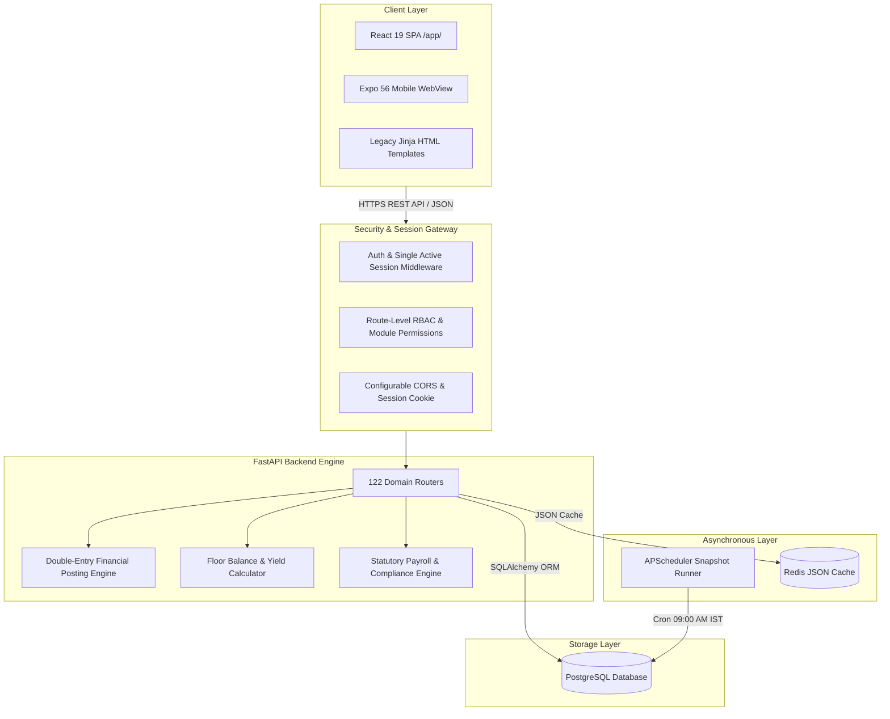

# BKNR ERP — Seafood Processing & Export SaaS ERP


**BKNR ERP** is a multi-tenant, enterprise-grade SaaS ERP system designed specifically for the seafood export industry (with specialized focus on shrimp processing, yield tracking, cold storage management, export compliance, and double-entry financial accounting).

Live Production: [https://bknrerp.in](https://bknrerp.in)

---

## 🏗️ System Architecture

BKNR ERP employs a decoupled client-server architecture with multi-tenant company isolation, robust security middleware, and daily background snapshot scheduling.



---

## 📦 Functional Modules

| Module | Core Capabilities |
| :--- | :--- |
| **Seafood Processing** | Gate Entry, Raw Material Purchasing (RMP), De-heading, Grading, Peeling, Soaking, Production Batches, Yield Tracking, and Floor Balance Summaries |
| **Inventory & Cold Storage** | Room/Chamber/Rack stock allocation, Stock Entry, Cold Storage Holding Reports, Pending Orders, Sales Dispatch, and Item Master management |
| **Finance & Accounts** | Double-entry Ledger, Journal Entries, Bank Transactions, Payment Receipts, Vendor Payments, Expense Vouchers, GST Registers, and Tally Integration |
| **Export Documents** | Proforma Invoices, Commercial Invoices, Packing Lists, Shipping Bills, Container Stuffing, Bill of Lading, and Health Certificates |
| **HR & Payroll** | Employee Registration, Daily Attendance, Labour Management, KG-basis Labour Rates, Monthly Salary Processing, PF/ESI Statutory calculations |
| **System Admin** | User RBAC, Single Active Session Enforcement, OTP Login (Brevo/SMTP), Feature Flags, Maintenance Modes (Soft/Hard), and Audit Logs |

---

## 🚀 Quickstart & Local Setup

### Prerequisites
- **Python**: `3.11` or `3.12`
- **Node.js**: `18.x` or `20.x`
- **PostgreSQL**: `14+`
- **Redis** *(Optional for local dev, recommended for production)*

---

### 1. Backend Setup

```bash
# Navigate to backend directory
cd backend

# Create virtual environment
python3 -m venv .venv
source .venv/bin/activate

# Install dependencies
pip install -r requirements.txt

# Create local environment configuration
cp .env.example .env

# Run database migrations
alembic upgrade head

# Start local FastAPI server
uvicorn app.main:application --reload --port 8000
```
Backend API will be available at `http://localhost:8000` (OpenAPI Docs at `http://localhost:8000/docs`).

---

### 2. Frontend Setup

```bash
# Navigate to frontend directory
cd frontend

# Install Node dependencies
npm install

# Start Vite development server
npm run dev
```
Frontend Web App will be available at `http://localhost:5173`. Vite proxies `/api`, `/auth`, `/admin`, and other endpoints to the FastAPI backend at `http://localhost:8000`.

---

## 🔑 Environment Variables Reference

Environment configuration templates are provided in [`backend/.env.example`](file:///Users/nagaraju/Documents/BKNR_ERP/backend/.env.example).

> [!IMPORTANT]
> When `ENVIRONMENT=production`, all required variables (`DATABASE_URL`, `SESSION_SECRET_KEY`, `DEPLOYMENT_TOKEN`, `SUPER_ADMIN_EMAILS`, `CORS_ORIGINS`) **must** be explicitly defined or the server will fail fast at startup.

| Variable | Required in Prod | Default (Dev) | Description |
| :--- | :---: | :--- | :--- |
| `ENVIRONMENT` | Yes | `development` | App runtime environment (`development`, `test`, `production`) |
| `DATABASE_URL` | Yes | `postgresql+psycopg2://...` | PostgreSQL connection string |
| `SESSION_SECRET_KEY` | Yes | Dev key | Secret key for session cookies and HMAC download tokens |
| `DEPLOYMENT_TOKEN` | Yes | Dev token | Secret token for release script and deploy lock endpoints |
| `SUPER_ADMIN_EMAILS` | Yes | `bknr.solutions@gmail.com` | Comma-separated super-admin email list |
| `CORS_ORIGINS` | Yes | `http://localhost:5173,...` | Comma-separated list of allowed CORS origin URLs |
| `REDIS_URL` | No | None | Connection URL for Redis cache |
| `BREVO_API_KEY` | No | None | Brevo API key for transactional emails & OTP |
| `SMTP_EMAIL` / `SMTP_PASSWORD` | No | None | Fallback SMTP email credentials |

---

## 🧪 Testing & Quality Assurance

### Run Backend Unit & Security Tests
```bash
cd backend
./.venv/bin/pytest tests/ -v
```

### Run Specific Test Categories
```bash
# Unit & Security Regressions
./.venv/bin/pytest tests/unit/ tests/security/ -v

# API Integration Tests
./.venv/bin/pytest tests/api/ -v
```

---

## 🚢 Deployment & Release Pipeline

The repository includes an enterprise release pipeline script at [`backend/scripts/release.sh`](file:///Users/nagaraju/Documents/BKNR_ERP/backend/scripts/release.sh).

```bash
# Export deploy token
export DEPLOYMENT_TOKEN="your_secure_deployment_token"

# Run automated release pipeline
bash backend/scripts/release.sh 1.2.3 "Release description"
```

### Pipeline Execution Steps:
1. Database Backup (`backup_db.sh`)
2. Git Clean State Verification
3. Alembic HEAD Migration Check
4. Automated Test Suite Execution (`pytest`)
5. Production Deployment Lock Acquisition
6. Git Version Tag Creation & Push (`v1.2.3`)
7. Health Checks (`/health/live`, `/health/ready`, `/api/version`)
8. DB Version Record Update & Lock Release

---

## 📁 Repository Map

```
BKNR_ERP/
├── backend/                  # FastAPI Application
│   ├── app/                  # Application Source
│   │   ├── database/         # SQLAlchemy Models & DB Session setup
│   │   ├── routers/          # 122 Domain API Routers
│   │   ├── services/         # Core Business Logic Services
│   │   ├── templates/        # Jinja HTML Templates
│   │   └── utils/            # Access Control, Security & Helper utilities
│   ├── alembic/              # Database Schema Migrations
│   ├── scripts/              # Release & DB Backup Automation Scripts
│   ├── tests/                # Pytest Test Suites (unit, api, security, load)
│   └── .env.example          # Backend Environment Template
├── frontend/                 # React 19 SPA Application
│   ├── src/                  # Components, Pages, Utilities, and Routes
│   └── package.json          # Vite & Frontend Dependencies
├── mobile/                   # Expo 56 Mobile WebView Wrapper
├── scripts/                  # Global Management Scripts
└── README.md                 # Root Repository Documentation
```
