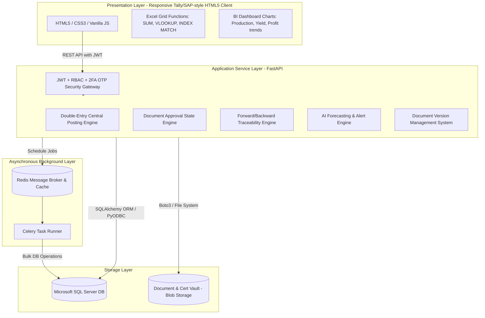

# Enterprise Seafood Export ERP - Master Architecture Blueprint

This document specifies the complete, production-ready enterprise architecture, SQL Server database schemas, FastAPI backend routers, database models, workflows, and frontend designs for the **Seafood Export ERP Software**.

---

## 1. Production-Ready Enterprise Architecture



---

## 2. Recommended Database Size & Module Mapping

To support the standard operations of a large seafood processor, the database is mapped across **480+ tables** grouped into 10 schema areas:

| Schema Area | Estimated Tables | Key Entities |
| :--- | :--- | :--- |
| **Masters** | 80+ | Company, Branch, Customer, Supplier, Farmer, Pond, Vessel, Product, Grading Scale, HSN Code |
| **Purchase** | 40+ | RFQ, PO Header, PO Detail, Goods Receipt Note (GRN), Supplier Invoice, Return Debit Notes |
| **Production**| 70+ | Production Plan, Batch Conversion Log (HOSO -> IQF), Yield Track, Packing Log, Cost Allocation |
| **Inventory** | 50+ | Stock Ledger, Bin Location Master, Multi-warehouse Transfers, Adjustments, Expiry Logs |
| **Export** | 60+ | Export Order, Commercial Invoice, Packing List, Shipping Bill, Bill of Lading, Certificate of Origin |
| **Accounts** | 80+ | Chart of Accounts, Cost Center, Journal Header, Journal Lines, Bank Reconciliation Master |
| **GST / Taxes**| 20+ | GST Sales/Purchase Register, HSN Summary, E-Invoice Tracking, E-Way Bill Logs |
| **HRMS** | 40+ | Employee Registration, Daily Face Attendance, Shifts, Salary Overtimes, PF/ESI Statutory Masters |
| **Audit/DMS** | 20+ | System Audit Logs, Document Version Control, File Attachment References |
| **Dashboards**| 20+ | KPI Metrics, Forecast Snapshots, BI Chart Caching Tables |

---

## 3. SQL Server DDL Schema Definitions (Selected Enterprise Modules)

### A. Traceability Ledger Tables
```sql
-- Pond Master (Farmer Source Details)
CREATE TABLE PondMaster (
    PondID INT IDENTITY(1,1) PRIMARY KEY,
    CompanyID VARCHAR(50) NOT NULL,
    FarmerName VARCHAR(150) NOT NULL,
    PondLocation NVARCHAR(255) NOT NULL,
    MPEDARegNo VARCHAR(50) NULL,
    WaterSource NVARCHAR(100) NULL,
    IsActive BIT DEFAULT 1
);

-- Harvest Lot Tracking
CREATE TABLE HarvestLot (
    LotID INT IDENTITY(1,1) PRIMARY KEY,
    CompanyID VARCHAR(50) NOT NULL,
    LotNumber VARCHAR(100) NOT NULL UNIQUE,
    PondID INT NOT NULL,
    HarvestDate DATE NOT NULL,
    QuantityHarvested DECIMAL(18,2) NOT NULL,
    TemperatureDecimal DECIMAL(5,2) NULL,
    QCStatus VARCHAR(20) DEFAULT 'PENDING' CHECK (QCStatus IN ('PENDING', 'APPROVED', 'REJECTED')),
    FOREIGN KEY (PondID) REFERENCES PondMaster(PondID)
);
CREATE INDEX IX_HarvestLot_LotNo ON HarvestLot(LotNumber);
```

### B. Advanced Seafood Production & Conversions
```sql
-- Production Batch Header
CREATE TABLE ProductionBatch (
    BatchID INT IDENTITY(1,1) PRIMARY KEY,
    CompanyID VARCHAR(50) NOT NULL,
    BatchNumber VARCHAR(100) NOT NULL UNIQUE,
    StartDate DATETIME DEFAULT GETDATE(),
    EndDate DATETIME NULL,
    Status VARCHAR(20) DEFAULT 'OPEN' CHECK (Status IN ('OPEN', 'CLOSED')),
    WastageQty DECIMAL(18,2) DEFAULT 0.00,
    YieldPercent DECIMAL(5,2) DEFAULT 0.00
);

-- Conversion Stage Log (HOSO -> HLSO -> Peeled -> PDTO -> IQF -> Packed)
CREATE TABLE ProductionConversion (
    ConversionID INT IDENTITY(1,1) PRIMARY KEY,
    BatchID INT NOT NULL,
    FromStage VARCHAR(30) NOT NULL, -- e.g., 'HOSO'
    ToStage VARCHAR(30) NOT NULL,   -- e.g., 'HLSO'
    InputWeight DECIMAL(18,3) NOT NULL,
    OutputWeight DECIMAL(18,3) NOT NULL,
    ProcessLoss DECIMAL(18,3) DEFAULT 0.00,
    LabourCost DECIMAL(18,2) DEFAULT 0.00,
    IceCost DECIMAL(18,2) DEFAULT 0.00,
    ElectricityCost DECIMAL(18,2) DEFAULT 0.00,
    CreatedDate DATETIME DEFAULT GETDATE(),
    FOREIGN KEY (BatchID) REFERENCES ProductionBatch(BatchID)
);
```

### C. Workflow Approvals & Hierarchy
```sql
-- Workflow Configuration
CREATE TABLE WorkflowConfig (
    ConfigID INT IDENTITY(1,1) PRIMARY KEY,
    CompanyID VARCHAR(50) NOT NULL,
    DocumentType VARCHAR(50) NOT NULL, -- e.g. 'PURCHASE_ORDER', 'EXPORT_INVOICE'
    ApproverRole VARCHAR(50) NOT NULL,  -- e.g. 'MANAGER', 'GM', 'CEO'
    ApprovalSequence INT NOT NULL       -- 1, 2, 3
);

-- Active Document Approvals Tracker
CREATE TABLE DocumentApproval (
    ApprovalID INT IDENTITY(1,1) PRIMARY KEY,
    CompanyID VARCHAR(50) NOT NULL,
    DocumentType VARCHAR(50) NOT NULL,
    DocumentID INT NOT NULL, -- PK of Target Table (e.g. PO ID)
    CurrentSequence INT DEFAULT 1,
    Status VARCHAR(20) DEFAULT 'PENDING' CHECK (Status IN ('PENDING', 'APPROVED', 'REJECTED')),
    LastUpdatedBy VARCHAR(100) NULL,
    LastUpdatedDate DATETIME NULL
);
```

---

## 4. Flow Diagrams & Traceability Paths

### Forward and Backward Traceability Flow
```
[ Pond / Farmer Source ]
        │ (Lot Number)
        ▼
[ Raw Material Reception (QC Inspection) ]
        │ (Batch Number Allocation)
        ▼
[ Advanced Production Conversions (HOSO -> Peeled -> IQF) ]
        │ (Packing Batch / Carton Count)
        ▼
[ Cold Storage Chambers ]
        │ (Carton Serial Barcodes)
        ▼
[ Container Stuffing & Loading ]
        │ (Container / Seal Number)
        ▼
[ Shipping Bill / Commercial Invoice Export ]
```

---

## 5. Standard API Routing Matrix

| Module | HTTP Method | Endpoint | Description |
| :--- | :--- | :--- | :--- |
| **Traceability** | `GET` | `/api/traceability/trace-forward/{lot_no}` | Resolves full supply chain up to container shipping bills |
| | `GET` | `/api/traceability/trace-backward/{container_no}` | Resolves backward path to source farmer and pond ID |
| **Production** | `POST` | `/api/production/batches` | Starts a processing batch log |
| | `POST` | `/api/production/conversions` | Books conversion details (HOSO to IQF) with cost allocations |
| **Workflows** | `POST` | `/api/workflow/submit` | Initiates document approval sequencing |
| | `POST` | `/api/workflow/approve` | Approves document (Requester -> Manager -> GM -> CEO) |
| **Compliance** | `POST` | `/api/compliance/certificates` | Stores MPEDA, FDA, EU compliance certificates to DMS |
